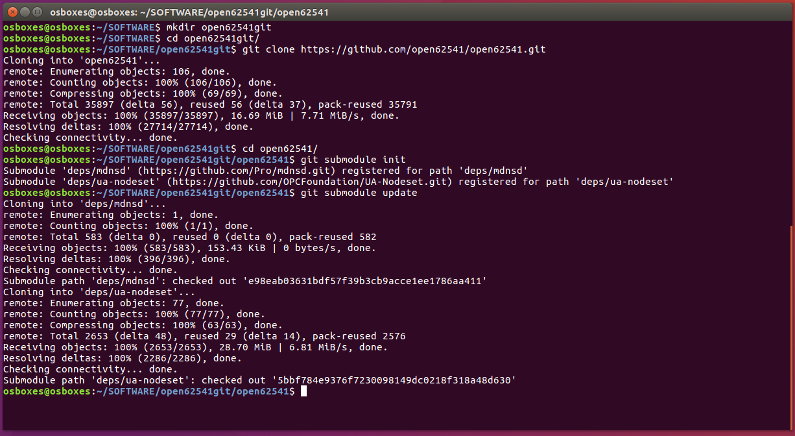
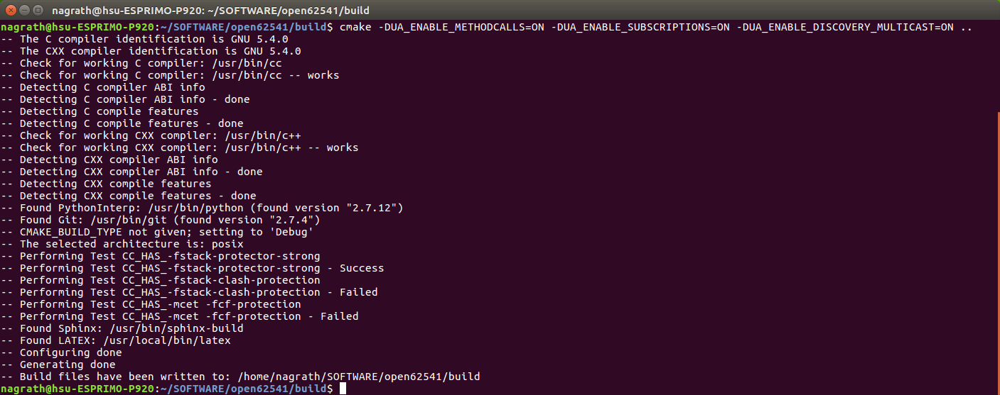
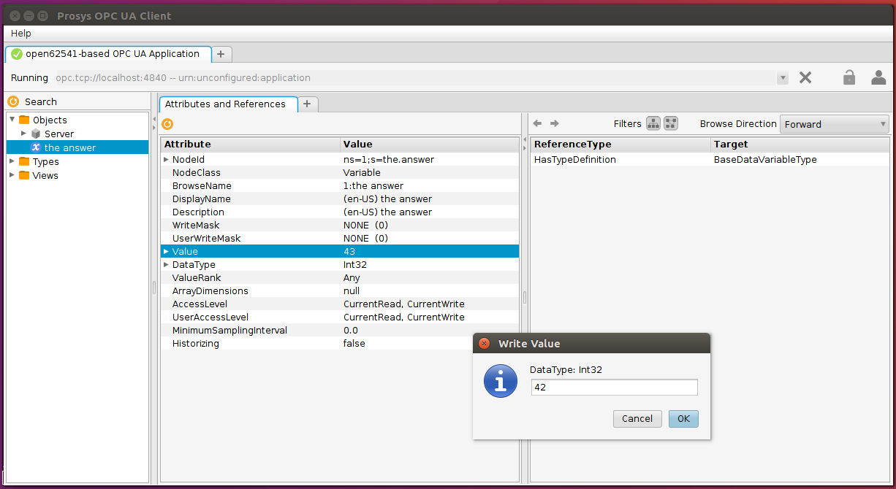

# OpcUaDeviceRepository

This repository consists of device driver implementations, each providing an OPC UA interface. The OPC UA interface is implemented using the [open62541](https://open62541.org/) C library which is encapsulated within the leightweight C++ Wrapper (see subfolder Open62541CppWrapper). Individual devices might have additional, platform-specific dependencies related to the respectivelly used device library. 

This repository is maintained by Servicerobotik Ulm. For more information see:

* Big picture: relation of repositories: https://wiki.servicerobotik-ulm.de/download
* SRRC Technical Wiki on SmartSoft and SmartMDSD Toolchain: https://wiki.servicerobotik-ulm.de

## Installation dependencies

  * [**open62541**](https://open62541.org/) using the [github repository](https://github.com/open62541/open62541) (install as described below)
  ** tested with commit in master branch 755abcfc54f5c7f438d0e1dee91370df28e6c02e
  * [**CMake**](https://cmake.org/) min. version **3.0**
  * A C++ compiler supporting the **C++ 11** standard

## Compile instructions for the open62541 library 

### Arranging prerequisites
```sh
$ sudo apt-get install git build-essential gcc pkg-config cmake python python-six
```
### Cloning open62541
```sh
$ git clone https://github.com/open62541/open62541.git
$ cd open62541
$ git submodule init
$ git submodule update
```


### Building open62541
```sh
$ mkdir build
$ cd build
$ cmake -DUA_ENABLE_METHODCALLS=ON -DUA_ENABLE_SUBSCRIPTIONS=ON -DUA_ENABLE_DISCOVERY_MULTICAST=ON ..
$ make
$ sudo make install
```

### Building and running OPCUA examples using single-file release open62541.h

Use cmake with flag UA_BUILD_EXAMPLES to build all examples.

```sh
$ cmake -DUA_BUILD_EXAMPLES=ON -DUA_ENABLE_METHODCALLS=ON -DUA_ENABLE_SUBSCRIPTIONS=ON -DUA_ENABLE_DISCOVERY_MULTICAST=ON ..
$ make
```

See also the official [Open62541 Online Build Instructions](https://open62541.org/doc/current/building.html) for further build options.

Now you can run individual examples.

```sh
$ cd bin/examples
$ ls
access_control_client          client_connect_loop            discovery_server_multicast  server_nodeset              tutorial_server_firststeps
access_control_server          client_subscription_loop       discovery_server_register   server_repeated_job         tutorial_server_method
client                         custom_datatype_client         server_ctt                  tutorial_client_events      tutorial_server_monitoreditems
client_async                   custom_datatype_server         server_inheritance          tutorial_client_firststeps  tutorial_server_object
client_connect                 discovery_client_find_servers  server_instantiation        tutorial_datatypes          tutorial_server_variable
client_connectivitycheck_loop  discovery_server_lds           server_mainloop             tutorial_server_datasource  tutorial_server_variabletype
```
### Open a Prosys OPC UA client to view/edit server nodes
**Address**: opc.tcp://<*IP address of server* / *localhost*>:4840



## Compile instructions for this repository

The following instructions will build the Open62541CppWrapper and all the OPC UA enabled Devices:

```
> mkdir build
> cd build
> cmake ..
> make 
> sudo make install # optional
```

